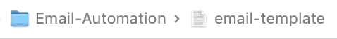

# Email-Automation

This repository contains a simple Python script to automate templated email writing, scheduling, and sending for Apple's MailOS.

## Motivation

Everytime I have been applying to internships and research positions I have found that there is a tedious and repetitive task I always do alongside applying to jobs: sending networking emails. My networking emails usually follow a similar template so I thought that rather than `cmd + a, cmd + c, cmd + v` the template manually every time, I can write a Python script that asks me for the information that changes between emails: the person I am addressing, the company, and the position I am applying for. This way, I can simply open up my terminal, run the command `send-email` and the script will ask me to provide the necessary information and then paste the email in and schedule to send it at my desired time (I like Mondays 8 AM). Let's talk about how to get this script working for you.

## Quick Start

first clone the repo from [this link](https://github.com/estebanpuyanas/Email-Automation) by using the Git CLI, IDE extension, or other favorite tool.

1. Now create a virtual enviornment by running the following command in the command line terminal: `python3 -m venv .venv`

2. Copy the `.env.template` in the `./src/` folder of the project, move it to the project root and rename it to `.env`, then replace the template path, sender, email, and signature to match the account you want to send the emails from. To find the exact template path needed in the `.env`, open Finder > navigate to the project location > select `email-template.txt` file > click the tab at the bottom of the Finder window and select `copy email-template as pathname` and paste that in the `.env TEMPLATE_PATH` field. The `SENDER_EMAIL, SIGNATURE` fields should match the exact format and casing used to set the account/signature up in MailOS, this information can be accessed by running `cmd + ,` inside the MailOS app.
   

3. Since we created a `venv` for the project, but we want the script to be globally executable from any terminal in the computer, we need to create a symbolic link from the project root to the `./src/` with another `.env` file, this way, when the script executes it will link the `.env` inside of `src` to the one in the project root, making it globally executable and not only `venv` executable. **Make sure that you have two `.env` files, one at the project root and the other at the `./src/` folder, addtionally, the `.env` inside `./src/` must be labeled as a symbolic link file**.

```
cd src
ln -sf ../.env .env
cd ..
```

After running these commands, the `.env` inside of `./src/` will look like this:

That right arrow signals the file has a symlink.

**Note**: As I am no bash/shell expert, this is the most elegant solution I was able to come up with to this problem, which originated from the desire to have a `.env` file instead of harcoding secrets like the account name and path, wihtout thius symlink, the terminal produces the following error when running the `send-email` command:
`ModuleNotFoundError: No module named 'email_automation_script'`
If anyone using this repo finds a more elegant solution and/or has suggestions on how to improve this, please feel free to open an issue or a pull request.

Now, run the following commands in the terminal to make the script a binary executable file (allowing us to run it as the `send-email` command).

4. Commands:

```
bash:
1. chmod +x src/email_automation_script.py (makes the .py file executable).
2. mkdir -p ~/bin (creates ./bin folder if not exists).
3. ln -sf "$(pwd)/src/email_automation_script.py" ~/bin/send-email (Only do this once to symbolically link the script as send-email)
(Add./bin to the shell's PATH)
4. echo 'export PATH="$HOME/bin:$PATH"' >> ~/.zshrc
5. source ~/.zshrc
```

Now, when you type `send-email` in the terminal, the application will run

## Script Workflow

Additionally, since the script uses Apple's System Events application to simulate keystrokes to enable email scheduling, you will need to ensure that System Events has accessibility enabled, to do this go to `System Settings` and navigate to: `Privacy & Security > Accessibility` click on the `+` to grant a new entity access and then navigate to the `Macintosh HD` folder and then locate the System Events application by doing the following: `System > Library > CoreSerivces > System Events`, you might need to grant similar permissions to your terminal of choice, but afterwards you should be good to go!

The script works in a very simple manner, atfer setting up some basic logging, the `_load_env()` function manually pulls the information from the `.env` file (did this since the `python-dotenv` library was cuasing some issues) that will later be used by the AppleScript. Then, we calculate when the next Monday will be using the `datetime` library. The script then generates the email template by using the user input for the company, position, recepient address/name, and then, the `schedule_email()` function internally runs an `AppleScript` which interacts directly with `MacOS` to open the mail app, generate, and schedule the email. There are a couple validation functions like regex matching for valid email format, and the main method allows the user to keep the program running to schedule multiple emails or close the program.

## Contributing

As Apple rolls out new operating systems, it is expected that this tool might breakdown or develop new bugs, should you encounter any issues while using this script or simply want to contribute to its development and upkeep, feel free to open a pull request or submit an issue!.
